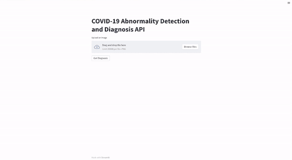

# COVID 19 Diagnosis using Chest Abnormality Detection and Localization with Deep Learning



This repository contains the code implementation of the academic project *COVID 19 Diagnosis using Chest Abnormality Detection and Localization with Deep Learning*. We have proposed two Deep CNN based Computer Vision models to create detections and perform classification. The model is designed to assist medical professionals in identifying COVID-19 cases from chest X-ray or lung CT scan images.

## Table of Contents

- [Introduction](#introduction)
- [Dataset](#dataset)
- [Requirements](#requirements)
- [Installation](#installation)
- [Model Architecture](#model-architecture)
- [Training](#training)
- [Evaluation](#evaluation)
- [Inference](#inference)
- [Contributing](#contributing)
- [License](#license)
- [Acknowledgments](#acknowledgments)

## Introduction

The outbreak of the COVID-19 pandemic has led to an overwhelming need for efficient diagnostic tools. Radiography images, such as chest X-rays and lung CT scans, have shown promise in aiding COVID-19 diagnosis. This project aims to provide a robust deep learning model that can accurately detect COVID-19 cases from radiography images.

## Dataset

Our model is trained on a curated dataset of chest X-ray and lung CT scan images, which is a combination of publicly available datasets from different sources. The datasets used for training and evaluation are as follows:

[2021 SIIM-FISABIO-RSNA Machine Learning COVID-19 Challenge](https://www.kaggle.com/competitions/siim-covid19-detection/data): This dataset contains chest X-ray images with corresponding labels for the conditions 'Negative for Pneumonia', 'Typical Appearance', 'Indeterminate Appearance', 'Atypical Appearance' along with annotations for localization tasks.

Please follow the provided links to access and download the datasets directly from their respective sources. Note that each dataset may have its own terms of use and citation requirements, so make sure to comply with the respective dataset's guidelines.

> Disclaimer: Please ensure that you have the necessary permissions and rights to use these datasets for research purposes, and always cite the original sources as per their requirements. Additionally, if you used any other private or restricted datasets in your research, mention them along with the appropriate citations in your thesis or published paper.Our model is trained on a curated dataset of chest X-ray and lung CT scan images. Unfortunately, due to data privacy restrictions, we cannot provide the dataset along with this repository. However, you can use publicly available COVID-19 radiography datasets from various online sources, such as Kaggle or academic institutions.

## Requirements

Although you can install and prep up your environment running python, and dependencies for the ML framework, it will be easy to setup an local environment with the power of docker contianer thanks to the [VSCode Dev Container](https://code.visualstudio.com/docs/devcontainers/containers)

- VSCode
- [VSCode Extension - Dev Containers](https://marketplace.visualstudio.com/items?itemName=ms-vscode-remote.remote-containers)
- Docker
- Python 3.9+
- Poetry - for dependency management
- PyTorch
- Nvidia CUDA Drives
- Streamlit - Frontend Application

## Installation

When you open the codebase in vscode, it will prompt for "Reopen Folder in Container". Once you press that, vscode will build the docker container declared in the Dockerfile so that all the system dependency will be installed. VSCode will refresh to open the code base inside a container with the bash terminal.

### Install Dependencies for Backend

```bash
poetry install
```

### Install Dependencies for Frontend

```bash
poetry install streamlit
```

Now you can explore and run the notebooks, run the backend server with `python run.py` and frontend server with `python app.py`

## Model Architecture

The deep CNN model architecture employed in this project is a variant of (insert name of the architecture if you used a well-known one). The model has (number of layers, filters, etc.).

## Training

To train the model, run the `train.ipynb` notebook, ensuring that you have your dataset appropriately organized. You can also adjust the training parameters as needed for your dataset size and hardware constraints.

## Evaluation

To evaluate the model's performance on your test dataset, run the `evaluate.ipynb` notebook. This will generate various metrics to assess the model's accuracy and effectiveness in COVID-19 diagnosis.

## Inference

For real-time inference on new radiography images, you can deploy the trained model using the inference server scripts. The `inference_server.py` script sets up an API server that listens for incoming requests and responds with predictions.

## Co-Authors

- Anjana G Joseph ([LinkedIn](https://www.linkedin.com/in/ferozkhanroz/))
- Feroz Khan A ([LinkedIn](https://www.linkedin.com/in/anjana-g-joseph/))
- Yuvaraj N (Mentor) ([LinkedIn](https://www.linkedin.com/in/dr-n-yuva-raj-68395729/))

## Thesis

The model and research presented in this repository are part of our undergraduate's thesis. You can find the complete thesis document at the following link:

- [Link to Thesis](https://acrobat.adobe.com/link/track?uri=urn:aaid:scds:US:65a23401-1a0e-422e-81cb-b114ccfad221)

## Publication

Our methodology for training and developing the deep learning model were developed as a research paper with the results and comparisons with existing algorithms. And it is published as a conference proceedings in AIP Conference Proceedings. You can find the copy in [INTERNATIONAL CONFERENCE ON ADVANCEMENT IN DESIGN, DEVELOPMENT, ENGINEERING, PROCESSING, AND CHARACTERIZATION: ADDEPC 2021 1-2 December 2021](https://pubs.aip.org/aip/acp/article-abstract/2853/1/020260/3290364/CovidXDetector-Deep-learning-based-chest) as CovidXDetector: Deep learning based chest abnormality detection for covid radiography diagnosis.

## Contributing

We welcome contributions to enhance the performance or usability of this model. If you find any issues or have suggestions for improvements, feel free to open an issue or submit a pull request.

## License

This project is licensed under the [MIT License](https://opensource.org/licenses/MIT).

## Acknowledgments

We would like to thank all the researchers and organizations who have made their datasets and pre-trained models available to the public. Their contributions have been invaluable in the development of this project.

**Citation (if applicable):**

```text
Arun Pandian Rathinakumar, N. Yuvaraj, D. Premkumar, Anjana George Joseph, A. Feroz Khan, K. R. Sri Preethaa; CovidXDetector: Deep learning based chest abnormality detection for covid radiography diagnosis. AIP Conf. Proc. 7 May 2024; 2853 (1): 020260. https://doi.org/10.1063/5.0197394
```

For any questions or inquiries, please contact: [arunpandian.srk@gmail.com](mailto:arunpandian.srk@gmail.com)

**Disclaimer:** This model is an aid to medical professionals and should not be used as a standalone diagnostic tool. Always consult with qualified healthcare professionals for accurate diagnosis and treatment.
